# ENTRENAMIENTO DE LA IA 
      
## WATSON ASSISTANT       

 Watson Assistant permite crear chatbots o asistentes virtuales en diferentes canales. 
    
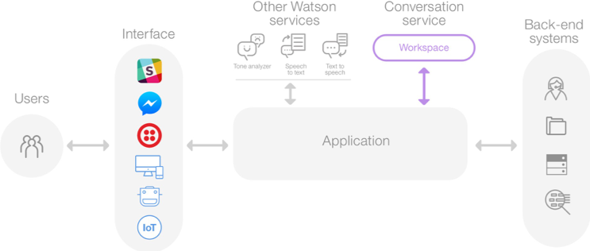      
<b> EJERCICIO 1: ASISTENTE PARA RESERVAR MESA EN UN RESTAURANTE </b>      

 Para comenzar a trabajar, crearemos un servicio de Watson Assistant en IBM Cloud y una vez creado, accedemos a él. 
    
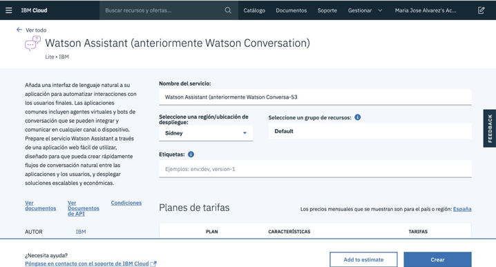      

 A continuación, hacemos clic sobre el botón azul "Iniciar Herramienta" para acceder a la herramienta de trabajo. 
      
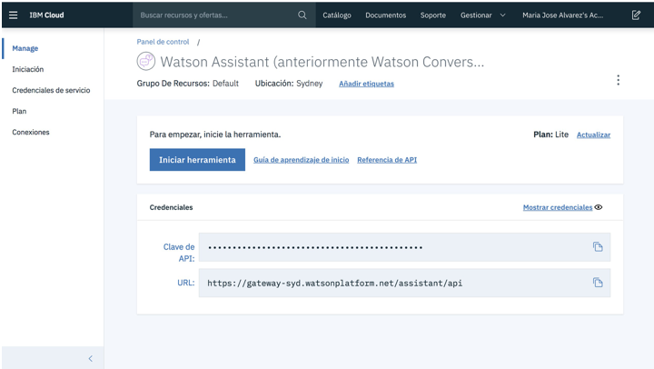      

 Una vez dentro, crearemos un espacio de trabajo (Workspace). Lo llamaremos "Reserva de mesa" y el idioma será español. 
      
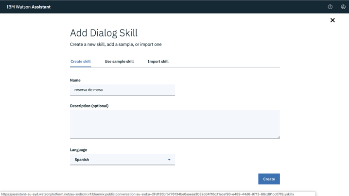      

 ¡Ya podemos empezar a entrenar a Watson! 
      

 <b> INTENCIONES (INTENTS) </b> 
      

 Los Intents hacen referencia a la acción que quiere realizar el usuario (verbos).   
El grupo de ejemplos de frases que el usuario puede utilizar para expresar una idea o un objetivo específico se etiquetan      
de la siguiente forma: #Idea.      
Para este ejercicio vamos a utilizar los siguientes Intents.       

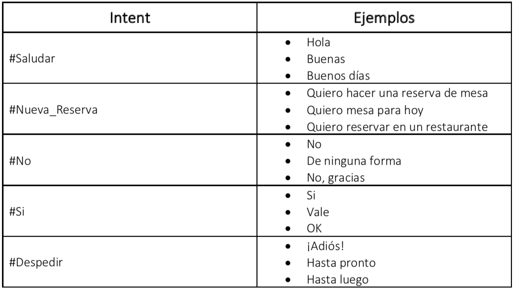      
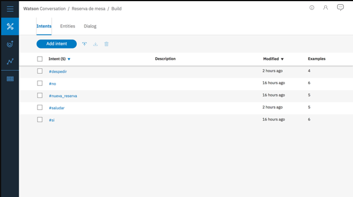      

 <b> ENTIDADES (ENTITIES) </b>
      

 Las entidades son los objetos sobre los que el usuario quiere actuar y son entradas que alteran la forma en que Watson  
responde a la intención del usuario.  
Para este ejercicio vamos a utilizar las siguientes Entities. 
      
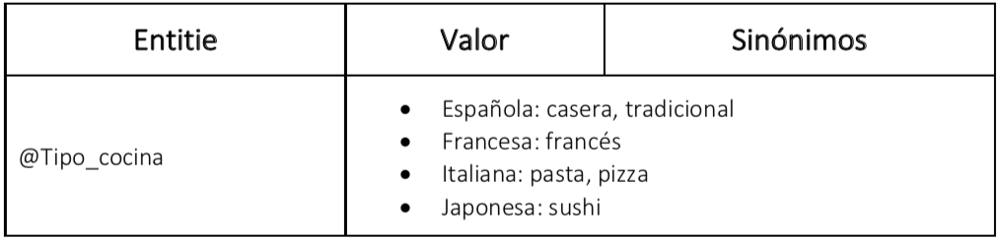      

 DIÁLOGO (DIALOG) 
      

 El diálogo es la secuencia que va a seguir nuestra conversación. Cuando creamos el diálogo, automáticamente nos crea   
dos nodos: "Bienvenido" y "En otras cosas". El nodo "Bienvenida" será el primero de la conversación y el nodo "En otras cosas"  
servirá para dar respuesta cuando no entendamos algo.       

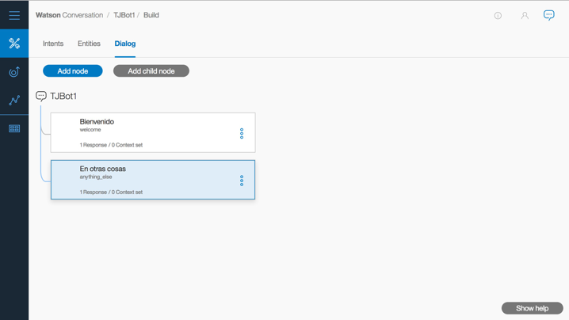      

 Si hacemos clic sobre el nodo "Bienvenida" podemos configurarlo. 
      
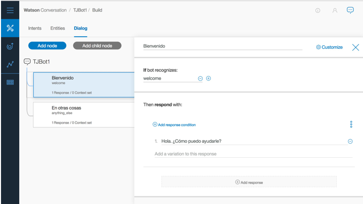      

 Para darnos la bienvenida, Watson dirá: "Hola. ¿Cómo puedo ayudarte?" Podemos cambiar esa frase por, por ejemplo, "Hola"  
y "Buenos días" (podemos añadir diferentes respuestas para que no siempre diga lo mismo).       

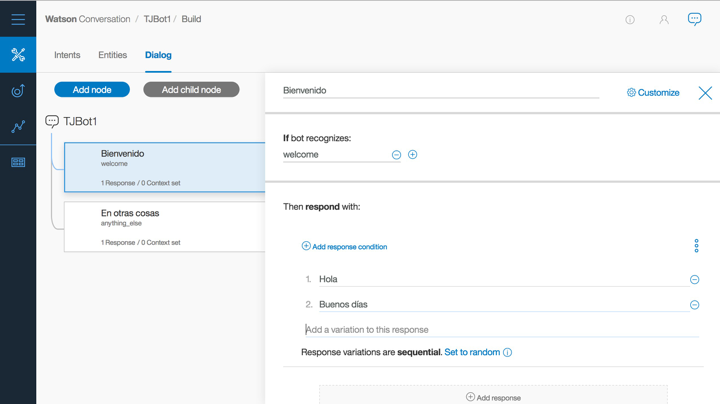      

 Si queremos que responda aleatoriamente "Hola" o "Buenos días", debemos pulsar el botón "Set to random".  
Ahora vamos a probar nuestra pequeña conversación; para ello hacemos clic sobre el símbolo de chat que hay arriba a   
la derecha. Observaremos que directamente Watson nos dirá "Hola" (también podría decir "Buenos días" ya que es aleatorio).       

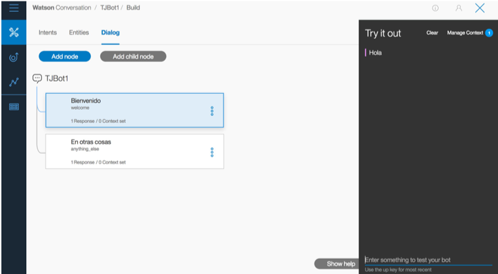      

 Vamos a comenzar creando un nuevo nodo, cuya función será responder al usuario cuando este salude. Por lo tanto, la condición será:   

<ul> 
<li>Si reconoce #saludar entonces ofrecer ayuda.</li>
</ul>      
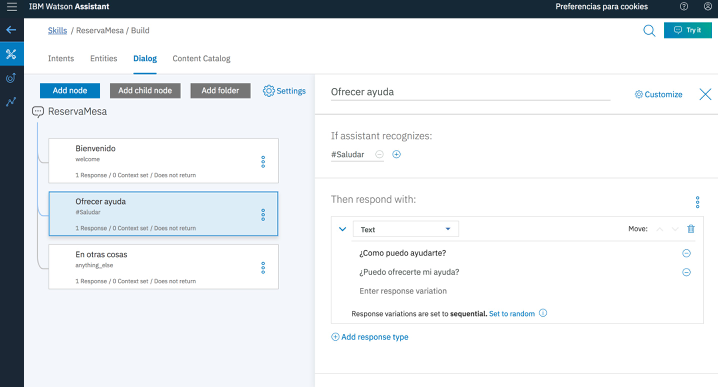      

 Vemos que hemos escrito las posibles respuestas, esto es para que el bot no siempre conteste lo mismo. Para ello, cambiamos la opción  
"Set to random". Ahora que hemos creado nuestro primer nodo, podemos probar la conversación. Para ello hacemos clic sobre el símbolo  
de diálogo arriba a la derecha.       

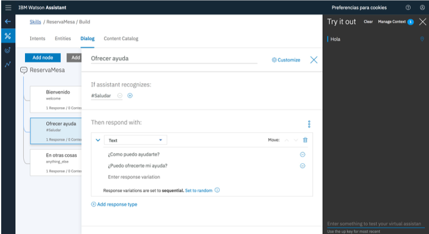      

 Probamos a contestar saludando y comprobamos que nos responde lo que le habíamos indicado en la configuración. 
      
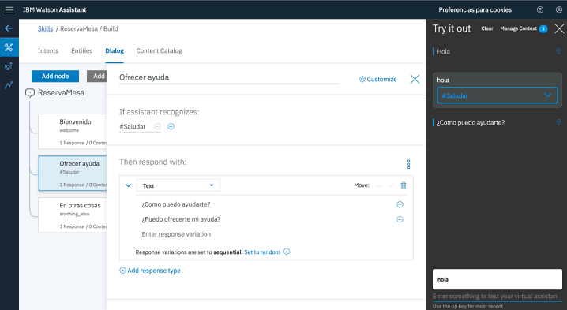      

 Ahora crearemos otro nodo para dar respuesta a las peticiones de reservas del usuario. Por lo tanto, la condición será: 
  
<ul> 
<li>Si #Nueva_Reserva entonces preguntar por tipo de cocina</li>
</ul>      
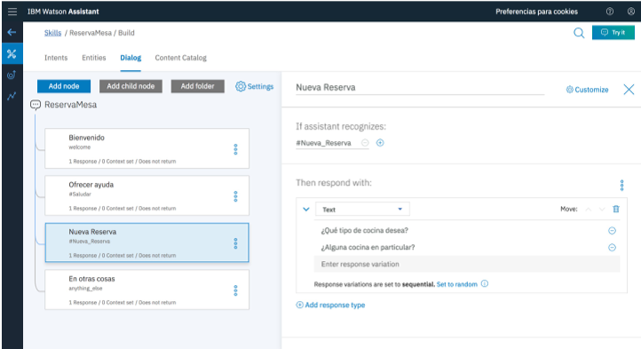      

 Probamos la conversación. 
      
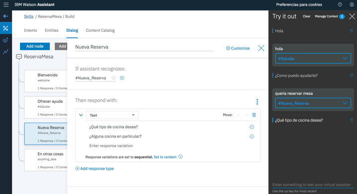      

 Lo último que faltaría, sería identificar el tipo de comida que desea el usuario. Para ello, añadimos un nuevo nodo a la  
conversación al que llamaremos "Confirmar cocina".  
En este caso, la condición será que el usuario especifique el tipo de restaurante que desea:   

<ul> 
<li>Si @Tipo_Cocina entonces confirmar reserva.</li>
</ul>      
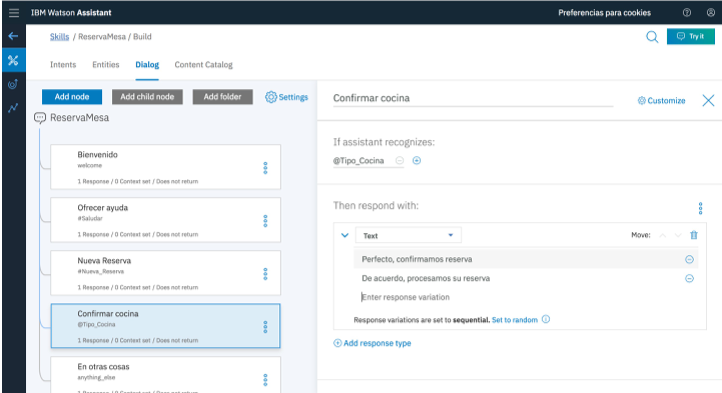      

 Y probamos. 

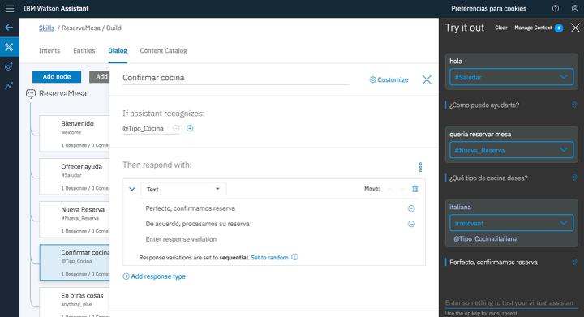      

 Para finalizar, vamos a dar las gracias al agente y a despedirnos. Para ello, vamos a crear un nuevo  
Intent: #agradecer.   
    
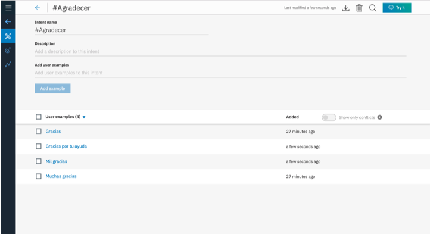      

 Volvemos al árbol de diálogo y creamos un nuevo nodo llamado "Gracias" y otro "Despedida" 
      
      
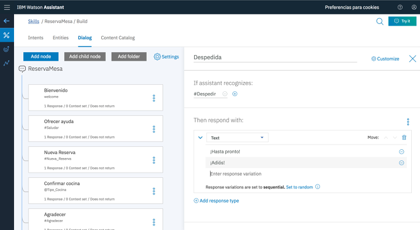      

 Probamos la conversación completa 
      
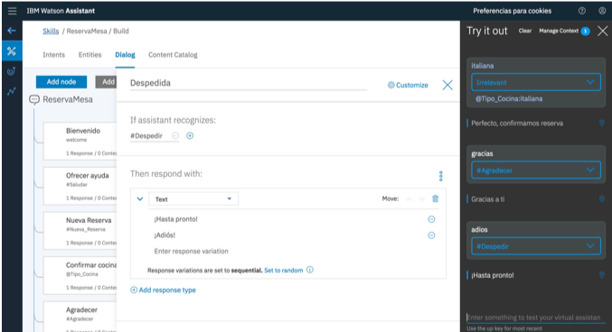      

 <b> ¡ Ya tenemos creada nuestra conversación con Watson Assistant! </b> 

